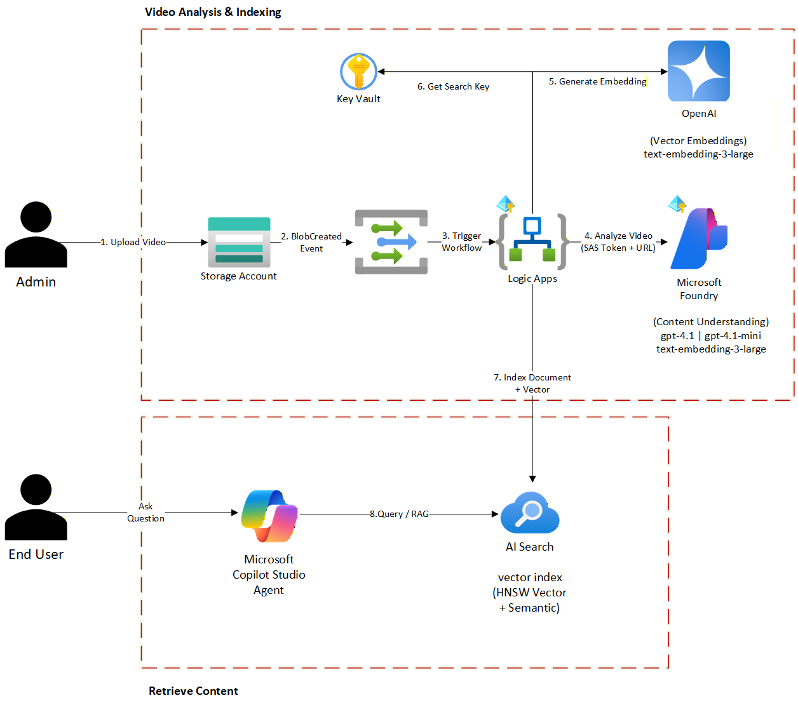

# Video RAG Accelerator

## Objectives

Copilot Studio is a native tool that can be extended with various Azure AI capabilities. Thanks to Microsoft's accelerators, we can enhance its functionality and significantly improve performance.

This accelerator enables **automated video content processing** for Retrieval-Augmented Generation (RAG). When training videos are uploaded to Azure Blob Storage, the system automatically:

- **Extracts** transcripts and AI-generated summaries using Azure Content Understanding
- **Generates** vector embeddings for semantic search
- **Indexes** content in Azure AI Search for retrieval by Copilot Studio

This enables your Copilot to answer questions based on video content, not just text documents.

### Use Cases
- Training video libraries
- Corporate knowledge management
- Educational content repositories
- Media asset management with natural language search

### Video Walkthrough

https://github.com/user-attachments/assets/08a26aad-2e44-414e-9f9a-87ec9239c82f

### Design



---

# Deployment

## 1) Prerequisites

### Azure Subscription Requirements
- Active Azure subscription with sufficient credits
- Contributor or Owner role on the subscription/resource group
- Ability to create and manage Azure resources

### Required Azure Services

| Service | Purpose |
|---------|---------|
| Azure Storage Account | Store uploaded videos |
| Microsoft Foundry (AI Services) | Content Understanding (video analysis) |
| Azure Key Vault | Securely store AI Search admin key |
| Azure OpenAI | Generate vector embeddings |
| Azure AI Search | Index and search content |
| Logic App | Workflow orchestration |
| Event Grid | Event-based triggers |

### Model Deployments Required

**In Azure OpenAI:**
- `text-embedding-3-large` - For generating vector embeddings (3072 dimensions)

**In Microsoft Foundry (Content Understanding):**
- `gpt-4.1` - For video understanding
- `gpt-4.1-mini` - For summarization
- `text-embedding-3-large` - For content vectorization

### Region Support

Not all regions support Content Understanding. The deployment restricts region selection to supported regions. See [Language and region support documentation](https://learn.microsoft.com/en-us/azure/ai-services/content-understanding/language-region-support#region-support) before selecting your region.

### Files Included in This Accelerator

| File | Description |
|------|-------------|
| `deploy/azuredeploy.json` | ARM template for one-click deployment |
| `setup-sample-code/logic-app-sample-code.json` | Logic App workflow definition |
| `setup-sample-code/ai-search-index-schema.json` | AI Search index definition sample |
| `images-samples/` | Screenshot references |
| `video-samples/` | Sample video files about Microsoft Copilot Studio |

> **Why Logic Apps?** Logic Apps provide a low-code way to orchestrate complex workflows with built-in connectors for Azure services, retry policies, and monitoring capabilities.

---

## 2) Automated Deployment (Recommended)

Deploy all required Azure resources with a single click:

[](https://portal.azure.com/#create/Microsoft.Template/uri/https%3A%2F%2Fraw.githubusercontent.com%2FAzure%2FCopilot-Studio-and-Azure%2Fmain%2Faccelerators%2FVideo-RAG%2Fdeploy%2Fazuredeploy.json)

### What the ARM Template Deploys

| Resource | Details |
|----------|---------|
| **Storage Account** | With `uploadedvideocontent` blob container for video uploads |
| **Azure AI Services (Foundry)** | Content Understanding service with gpt-4.1, gpt-4.1-mini, and text-embedding-3-large model deployments |
| **Azure AI Foundry Hub & Project** | Hub workspace connected to AI Services, with a default project |
| **Azure Key Vault** | Stores the AI Search admin key as a secret for secure access at runtime |
| **Azure OpenAI** | Separate resource with text-embedding-3-large deployment for AI Search integrated vectorization |
| **Azure AI Search** | Search service with the `video-training-index` automatically created (includes fields, HNSW vector search, semantic configuration, and OpenAI vectorizer) |
| **Logic App** | Complete video processing workflow with Event Grid trigger, deployed from [logic-app-sample-code.json](setup-sample-code/logic-app-sample-code.json) with all resource URLs resolved |
| **Event Grid API Connection** | Connects the Logic App trigger to Storage Account blob events |

### Security & Managed Identity

The Logic App and AI Services are deployed with **system-assigned managed identities**. All RBAC role assignments are configured automatically:

**Logic App Managed Identity:**

| Role | Target Resource | Purpose |
|------|----------------|---------|
| Storage Blob Data Reader | Storage Account | Read uploaded video blobs |
| Storage Account Contributor | Storage Account | Generate SAS tokens for Content Understanding blob access |
| EventGrid EventSubscription Contributor | Storage Account | Create event subscriptions for blob triggers |
| Cognitive Services User | Azure AI Services | Call Content Understanding APIs |
| Cognitive Services OpenAI User | Azure OpenAI | Generate vector embeddings |
| Key Vault Secrets User | Azure Key Vault | Retrieve AI Search admin key at runtime |

**AI Services Managed Identity:**

| Role | Target Resource | Purpose |
|------|----------------|---------|
| Storage Blob Data Reader | Storage Account | Allow Content Understanding to read video files from blob storage |

The AI Search admin key is stored in Key Vault and retrieved by the Logic App at runtime using managed identity, so no secrets are embedded in the workflow definition.

### Template Parameters

| Parameter | Description | Default |
|-----------|-------------|---------|
| **location** | Azure region (restricted to Content Understanding supported regions) | *(required)* |
| **resourcePrefix** | Naming prefix for all resources (3-10 chars, lowercase) | `videorag` |
| **searchServiceSku** | Pricing tier for AI Search | `basic` |

### Post-Deployment Steps

After the ARM template completes, there is **one manual step** required to authorize the Event Grid connection:

1. In your Resource Group, click on the **azureeventgrid-1** API Connection resource
2. In the left menu, click **Edit API connection**
3. Click **Authorize** and sign in with your Azure credentials
4. Click **Save**
5. Navigate to the **Logic App** → open the **Logic App Designer** and verify the Event Grid trigger shows as connected (no warning banner)

> **Why is this manual?** The Event Grid connector uses a V1 API connection which requires interactive OAuth consent. This is the only step that cannot be automated via ARM.

Optionally, verify that gpt-4.1, gpt-4.1-mini, and text-embedding-3-large model deployments succeeded in your selected region. If a model deployment failed due to regional availability, create it manually in the Azure AI Foundry portal.

After completing the post-deployment step, skip to [Section 5 - Testing](#5-testing-the-solution).

---

## 3) Manual Deployment

> **Note:** If you used the automated ARM template deployment above, skip this section entirely and go to [Section 5 - Testing](#5-testing-the-solution).

### 3.1 Create a Resource Group

1. Navigate to the [Azure Portal](https://portal.azure.com)
2. Click **"Create a resource"** → Search for **"Resource group"**
3. Configure:
   - **Subscription:** Select your subscription
   - **Resource group name:** `VideoRAG-Project-RG`
   - **Region:** Select a region that supports all services (e.g., Sweden Central, East US 2)
4. Click **"Review + create"** → **"Create"**

### 3.2 Create Storage Account

1. Click **"Create a resource"** → Search for **"Storage account"**
2. Configure:
   - **Resource group:** `VideoRAG-Project-RG`
   - **Storage account name:** `videoragstorage` (must be globally unique)
   - **Region:** Same as resource group
3. After creation, go to **Containers** → **"+ Container"**
4. Create container named: `uploadedvideocontent`

### 3.3 Create Microsoft Foundry for Content Understanding

1. Click **"Create a resource"** → Search for **"Microsoft Foundry"**
2. Configure:
   - **Resource group:** `VideoRAG-Project-RG`
   - **Region:** Same region (must support Content Understanding)
   - **Name:** `videorag-foundry`
   - **Default project name:** `videorag-foundry-proj-default`
3. After creation, navigate to the AI Services resource → **"Identity"** → **"System assigned"** → Set to **"On"** and click **"Save"**

> **Why enable identity on AI Services?** Content Understanding needs its own managed identity to read video files from blob storage.

### 3.4 Create Azure Key Vault

1. Click **"Create a resource"** → Search for **"Key Vault"**
2. Configure:
   - **Resource group:** `VideoRAG-Project-RG`
   - **Key vault name:** `videorag-kv`
   - **Region:** Same as resource group
   - **Permission model:** Azure role-based access control (RBAC)

### 3.5 Create Azure OpenAI Service

> **Important:** You must create an Azure OpenAI resource directly in the Azure portal. Azure OpenAI resources (with access to embedding models) that were created in the Microsoft Foundry portal aren't supported for integrated vectorization with AI Search.
>
> Reference: [Integrated vectorization documentation](https://learn.microsoft.com/en-us/azure/search/search-how-to-integrated-vectorization?tabs=prepare-data-storage%2Cprepare-model-aoai)

1. Click **"Create a resource"** → Search for **"Azure OpenAI"**
2. Configure:
   - **Resource group:** `VideoRAG-Project-RG`
   - **Name:** `videorag-openai`
3. After creation, go to **Azure OpenAI portal** → **Deployments**
4. Click **"+ Create new deployment"**:
   - **Model:** `text-embedding-3-large`
   - **Deployment name:** `text-embedding-3-large`

### 3.6 Create Azure AI Search

1. Click **"Create a resource"** → Search for **"Azure AI Search"**
2. Configure:
   - **Resource group:** `VideoRAG-Project-RG`
   - **Service name:** `videorag-search`
3. After creation, go to **Keys** and copy the **Primary admin key**
4. Navigate to your **Key Vault** → **Secrets** → **"+ Generate/Import"**
   - **Name:** `search-admin-key`
   - **Value:** Paste the AI Search primary admin key
   - Click **"Create"**

### 3.7 Create AI Search Index

1. Navigate to your AI Search resource
2. Go to **"Indexes"** → **"+ Add index"**
3. Set **Index name:** `video-training-index`

**Configure Fields:**


**Configure Vector Search:**

1. Scroll to **"Vector profiles"** → **"+ Add vector profile"**
2. Configure:
   - **Profile name:** `vector-profile`
   - **Algorithm:** HNSW
3. Configure `contentVector` field:
   - **Dimensions:** `3072` (for text-embedding-3-large)
   - **Vector search profile:** `vector-profile`


4. Click **"Create"**

### 3.8 Create the Logic App

1. Click **"Create a resource"** → Search for **"Logic App"**
2. Configure:
   - **Resource group:** `VideoRAG-Project-RG`
   - **Logic App name:** `videorag-automation`
   - **Region:** Same as other resources
3. After creation, navigate to **"Identity"** → **"System assigned"**
4. Set Status to **"On"** → Click **"Save"**


5. Note the **Object ID** for RBAC assignments

### 3.9 Configure Permissions (RBAC)

The Logic App's and AI Services' Managed Identities need access to Azure services.

**3.9.1 Grant Storage Access (Logic App)**

1. Navigate to Storage Account → **"Access Control (IAM)"**
2. Click **"+ Add"** → **"Add role assignment"**
3. Add these roles for your Logic App:
   - `Storage Blob Data Reader`
   - `Storage Account Contributor`
   - `EventGrid EventSubscription Contributor`

> **Why Storage Account Contributor?** The Logic App generates a short-lived SAS token (1 hour) at runtime so Content Understanding can read the video blob without enabling anonymous access on the storage account.

**3.9.2 Grant Storage Access (AI Services)**

1. Navigate to Storage Account → **"Access Control (IAM)"**
2. Add role assignment:
   - **Role:** `Storage Blob Data Reader`
   - **Select:** Your AI Services resource (Content Understanding needs to read video files)

**3.9.3 Grant Foundry Access**

1. Navigate to Foundry → **"Access Control (IAM)"**
2. Add role assignment:
   - **Role:** `Cognitive Services User`
   - **Select:** Your Logic App

**3.9.4 Grant OpenAI Access**

1. Navigate to Azure OpenAI → **"Access Control (IAM)"**
2. Add role assignment:
   - **Role:** `Cognitive Services OpenAI User`
   - **Select:** Your Logic App

**3.9.5 Grant Key Vault Access**

1. Navigate to Key Vault → **"Access Control (IAM)"**
2. Add role assignment:
   - **Role:** `Key Vault Secrets User`
   - **Select:** Your Logic App

**Permission Summary:**

| Identity | Resource | Role |
|----------|----------|------|
| Logic App | Storage Account | Storage Blob Data Reader |
| Logic App | Storage Account | Storage Account Contributor |
| Logic App | Storage Account | EventGrid EventSubscription Contributor |
| Logic App | Microsoft Foundry | Cognitive Services User |
| Logic App | Azure OpenAI | Cognitive Services OpenAI User |
| Logic App | Azure Key Vault | Key Vault Secrets User |
| AI Services | Storage Account | Storage Blob Data Reader |

> **Note:** Role assignments can take up to 10 minutes to propagate.

---

## 4) Build the Logic App Workflow (Manual Only)

> **Note:** If you used the ARM template, the Logic App workflow is deployed automatically with all resource URLs and secrets resolved. Skip to [Section 5 - Testing](#5-testing-the-solution).

### 4.1 Workflow Overview

The Logic App performs these steps:

```
┌─────────────────┐     ┌─────────────────┐     ┌──────────────────────┐
│  Blob Storage   │────▶│  Event Grid     │────▶│    Logic App         │
│  (Video Upload) │     │  Trigger        │     │                      │
└─────────────────┘     └─────────────────┘     │  1. Parse Event      │
                                                │  2. Generate SAS     │
                                                │  3. Call Content     │
                                                │     Understanding    │
                                                │  4. Poll for Status  │
                                                │  5. Extract Content  │
                                                │  6. Generate Vector  │
                                                │  7. Get Key from KV  │
                                                │  8. Push to Search   │
                                                └──────────────────────┘
```

### 4.2 Add Event Grid Trigger

1. Open Logic App Designer
2. Search for **"Event Grid"** → Select **"When a resource event occurs"**
3. Configure:
   - **Resource Type:** `Microsoft.Storage.StorageAccounts`
   - **Resource Name:** Your storage account
   - **Event Type:** `Microsoft.Storage.BlobCreated`
4. Add **Prefix Filter:** `/blobServices/default/containers/uploadedvideocontent`
5. Click **Settings** (⋯) → Enable **Concurrency Control** → Set to `50`

### 4.3 Add Parse JSON (Parse Trigger)

1. Click **"+ New step"** → Search **"Parse JSON"**
2. Configure:
   - **Content:** Expression: `first(triggerBody())`
   - **Schema:**

```json
{
  "type": "object",
  "properties": {
    "topic": { "type": "string" },
    "subject": { "type": "string" },
    "eventType": { "type": "string" },
    "id": { "type": "string" },
    "data": {
      "type": "object",
      "properties": {
        "api": { "type": "string" },
        "clientRequestId": { "type": "string" },
        "requestId": { "type": "string" },
        "eTag": { "type": "string" },
        "contentType": { "type": "string" },
        "contentLength": { "type": "integer" },
        "blobType": { "type": "string" },
        "accessTier": { "type": "string" },
        "url": { "type": "string" },
        "sequencer": { "type": "string" },
        "storageDiagnostics": {
          "type": "object",
          "properties": {
            "batchId": { "type": "string" }
          }
        }
      }
    },
    "dataVersion": { "type": "string" },
    "metadataVersion": { "type": "string" },
    "eventTime": { "type": "string" }
  }
}
```

3. Rename to `Parse_trigger_body`

### 4.4 Initialize Variables

Add two **Initialize variable** actions. The first initializes blob info variables together, and the second creates the document ID (kept separate because it depends on `vBlobUrl`):

**Action 1: `varBlobInfo`**

| Variable Name | Type | Value (Expression) |
|---------------|------|-------------------|
| `vBlobUrl` | String | `body('Parse_trigger_body')?['data']?['url']` |
| `vBlobName` | String | `last(split(body('Parse_trigger_body')?['data']?['url'],'/'))` |
| `vContainer` | String | `split(body('Parse_trigger_body')?['data']?['url'],'/')[3]` |

**Action 2: `varDocumentId`** (runs after `varBlobInfo`)

| Variable Name | Type | Value (Expression) |
|---------------|------|-------------------|
| `vDocumentId` | String | `base64(variables('vBlobUrl'))` |


> **Important:** The `vDocumentId` uses Base64 encoding to create a valid AI Search document key. This handles ALL special characters automatically (spaces, slashes, dots, etc.).

### 4.5 Add HTTP Action (Set Defaults)

1. Add **HTTP** action
2. Configure:
   - **Method:** `PATCH`
   - **URI:** `https://<your-ai-services>.services.ai.azure.com/contentunderstanding/defaults?api-version=2025-11-01`
   - **Headers:** `Content-Type: application/json`
   - **Body:**
```json
{
    "modelDeployments": {
        "gpt-4.1": "gpt-4.1",
        "gpt-4.1-mini": "gpt-4.1-mini",
        "text-embedding-3-large": "text-embedding-3-large"
    },
    "storage": {
        "type": "AzureBlob",
        "containerUri": "https://<your-storage>.blob.core.windows.net/uploadedvideocontent"
    }
}
```
   - **Authentication:** System-assigned managed Identity
   - **Audience:** `https://cognitiveservices.azure.com`


3. Rename to `Set_defaults`

### 4.6 Add HTTP Action (Generate SAS Token)

1. Add **HTTP** action
2. Configure:
   - **Method:** `POST`
   - **URI:** `https://management.azure.com/subscriptions/<your-subscription-id>/resourceGroups/<your-resource-group>/providers/Microsoft.Storage/storageAccounts/<your-storage-account>/ListServiceSas?api-version=2023-05-01`
   - **Body:**
```json
{
    "canonicalizedResource": "/blob/<your-storage-account>/uploadedvideocontent",
    "signedResource": "c",
    "signedPermission": "r",
    "signedProtocol": "https",
    "signedExpiry": "@{addHours(utcNow(), 1)}"
}
```
   - **Authentication:** System-assigned Managed Identity
   - **Audience:** `https://management.azure.com`
3. Enable **Secure Outputs** in settings to hide the SAS token from run history
4. Rename to `Generate_SAS_Token`

> **Why SAS?** The storage account blocks anonymous access. This step generates a read-only, 1-hour SAS token so Content Understanding can securely access the video blob.

### 4.7 Add HTTP Action (Call Content Understanding)

1. Add **HTTP** action
2. Configure:
   - **Method:** `POST`
   - **URI:** `https://<your-ai-services>.cognitiveservices.azure.com/contentunderstanding/analyzers/prebuilt-videoSearch:analyze?api-version=2025-11-01`
   - **Headers:** `Content-Type: application/json`
   - **Body:**
```json
{
    "inputs": [
        {
            "url": "@{variables('vBlobUrl')}?@{body('Generate_SAS_Token')?['serviceSasToken']}"
        }
    ]
}
```
   - **Authentication:** System-assigned Managed Identity
   - **Audience:** `https://cognitiveservices.azure.com`


3. Rename to `Call_Content_Understanding`

### 4.8 Parse CU Body

1. Click **"+ New step"** → Search **"Parse JSON"**
2. Configure:
   - **Content:** Expression: `body('Call_Content_Understanding')`
   - **Schema:**

```json
{
  "type": "object",
  "properties": {
    "id": { "type": "string" },
    "status": { "type": "string" },
    "result": {
      "type": "object",
      "properties": {
        "analyzerId": { "type": "string" },
        "apiVersion": { "type": "string" },
        "createdAt": { "type": "string" },
        "warnings": { "type": "array" },
        "contents": { "type": "array" }
      }
    }
  }
}
```

### 4.9 Initialize Polling Variables

Add a single **Initialize variable** action with both variables:

| Variable Name | Type | Value (Expression) |
|---------------|------|-------------------|
| `vOperationLocation` | String | `outputs('Call_Content_Understanding')?['headers']?['Operation-Location']` |
| `vAnalyzerStatus` | String | `notStarted` |

### 4.10 Add Polling Loop (Until)

1. Add **Until** action
2. Set condition (Advanced mode):
```
@or(equals(variables('vAnalyzerStatus'), 'succeeded'), equals(variables('vAnalyzerStatus'), 'failed'))
```

3. Set limits:
   - **Count:** `120`
   - **Timeout:** `PT1H`


### Inside the Until loop, add:

**a) Delay Action**
- **Count:** `15`
- **Unit:** `Second`

**b) HTTP Action (Check_Status)**
- **Method:** `GET`
- **URI:** `@variables('vOperationLocation')`
- **Authentication:** System-assigned managed Identity, Audience: `https://cognitiveservices.azure.com`

**c) Parse JSON**
- **Content:** `@body('Check_Status')`

**d) Set Variable**
- **Name:** `vAnalyzerStatus`
- **Value:** `@body('Parse_JSON')?['status']`

### 4.11 Add Failure Check Condition

1. After Until loop, add **Condition**
2. Set condition (Advanced mode):
```
@equals(variables('vAnalyzerStatus'), 'failed')
```

3. In **True** branch, add **Terminate**:
   - **Status:** Failed
   - **Message:** `Content Understanding analysis failed for @{variables('vBlobName')}`

### 4.12 Parse Final Result

1. Add **Parse JSON** action
2. Configure:
   - **Content:** `@body('Check_Status')`
   - **Schema:** Use the comprehensive schema from [logic-app-sample-code.json](setup-sample-code/logic-app-sample-code.json) (`Parse_Call_Result_JSON` action), which includes `contents`, `transcriptPhrases`, `fields`, `Summary`, and `usage` properties.

3. Rename to `Parse_Call_Result_JSON`

### 4.13 Initialize Transcript and Summary Variables

Add a single **Initialize variable** action with both variables:

| Variable Name | Type | Value |
|---------------|------|-------|
| `vTranscriptText` | String | *(empty)* |
| `vSummaryText` | String | *(empty)* |

### 4.14 Add For Each Loop (Extract Content)

1. Add **For each** action
2. Set **From:** `@body('Parse_Call_Result_JSON')?['result']?['contents']`

### Inside the loop, add:

**a) Append Summary**
- **Variable:** `vSummaryText`
- **Value:** `@{if(equals(items('For_each_content')?['fields']?['Summary']?['valueString'], null), '', concat(items('For_each_content')?['fields']?['Summary']?['valueString'], ' '))}`

**b) Select Phrases**
- **From:** `@if(equals(items('For_each_content')?['transcriptPhrases'], null), json('[]'), items('For_each_content')?['transcriptPhrases'])`
- **Select:** `@item()?['text']`

**c) Append Transcript**
- **Variable:** `vTranscriptText`
- **Value:** `@{join(body('Select_Phrases'), ' ')} `


### 4.15 Add Content Check and Final Actions

1. Add **Condition** to check content exists:
```
@greater(length(trim(variables('vTranscriptText'))), 0)
```

### In True branch:

**a) Compose Search Content**
```
@take(concat(trim(variables('vSummaryText')), ' ', trim(variables('vTranscriptText'))), 8000)
```

**b) Generate Embedding (HTTP)**
- **Method:** `POST`
- **URI:** `https://<your-openai>.openai.azure.com/openai/deployments/text-embedding-3-large/embeddings?api-version=2024-06-01`
- **Body:**
```json
{
    "input": "@{outputs('Compose_Search_Content')}"
}
```
- **Authentication:** System-assigned managed Identity, Audience: `https://cognitiveservices.azure.com`
- **Retry Policy:** Exponential, Count: 3

**c) Get Search Key from Key Vault (HTTP)**
- **Method:** `GET`
- **URI:** `https://<your-keyvault>.vault.azure.net/secrets/search-admin-key?api-version=7.4`
- **Authentication:** System-assigned Managed Identity, Audience: `https://vault.azure.net`
- Enable **Secure Outputs** in settings to hide the key from run history

**d) Push to AI Search (HTTP)**
- **Method:** `POST`
- **URI:** `https://<your-search>.search.windows.net/indexes/video-training-index/docs/index?api-version=2024-07-01`
- **Headers:**
  - `Content-Type: application/json`
  - `api-key: @{body('Get_Search_Key')?['value']}`
- **Body:**
```json
{
    "value": [
        {
            "@search.action": "mergeOrUpload",
            "id": "@{variables('vDocumentId')}",
            "title": "@{variables('vBlobName')}",
            "sourceUrl": "@{variables('vBlobUrl')}",
            "type": "training-video",
            "summary": "@{trim(variables('vSummaryText'))}",
            "content": "@{trim(variables('vTranscriptText'))}",
            "createdAt": "@{utcNow()}",
            "contentVector": "@body('Generate_Embedding')?['data'][0]['embedding']"
        }
    ]
}
```
- **Retry Policy:** Exponential, Count: 3

### In False branch:

Add **Terminate** with Failed status: `No transcript content extracted`

### 4.16 Save the Logic App

Click **"Save"** in the toolbar.

---

# 5) Testing the Solution

## 5.1 Upload Test Video

1. Navigate to Storage Account → **Containers** → `uploadedvideocontent`
2. Click **"Upload"** → Select a test video (MP4 recommended)
3. Start with a short video (1-2 minutes) for faster testing

## 5.2 Monitor Logic App Run

1. Navigate to Logic App → **"Overview"**
2. Check **"Runs history"** for new run
3. Click on run to see details
4. Verify all actions show green checkmarks

## 5.3 Verify AI Search Results

1. Navigate to AI Search → **"Search explorer"**
2. Run query: `*`
3. Verify document appears with:
   - Title (filename)
   - Summary text
   - Transcript content
   - Content vector array

---

# 6) Connect to Copilot Studio

## 6.1 Create Custom Connector

To query the indexed videos from Copilot Studio, you can:

1. Use the built-in **Azure AI Search** connector


2. Create an Agent & attach the knowledge base (the AI Search)


## 6.2 Query Videos by Content

Once indexed, videos can be searched using:

- **Keyword search:** Find videos mentioning specific terms
- **Semantic search:** Find videos by meaning/concept
- **Hybrid search:** Combine both approaches

Example search query for Copilot:
```
"What are the best ways to use Microsoft Copilot according to training videos?"
```

The AI Search index returns matching videos with their source URLs, enabling playback or linking.

---


## Appendix — Useful References

- [Azure Content Understanding Documentation](https://learn.microsoft.com/azure/ai-services/content-understanding/)
- [Azure AI Search Vector Search](https://learn.microsoft.com/azure/search/vector-search-overview)
- [Logic Apps Managed Identity](https://learn.microsoft.com/azure/logic-apps/create-managed-service-identity)
- [Azure OpenAI Embeddings](https://learn.microsoft.com/azure/ai-services/openai/concepts/understand-embeddings)
- [Copilot Studio Connectors](https://learn.microsoft.com/microsoft-copilot-studio/advanced-connectors)
- [Microsoft Foundry Overview](https://learn.microsoft.com/en-us/azure/ai-foundry/what-is-foundry)
